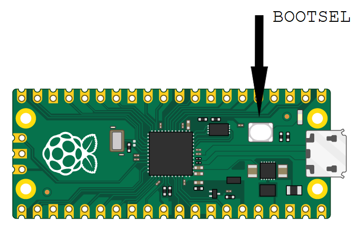

# MicroPython

[MicroPython](https://www.raspberrypi.com/documentation/microcontrollers/micropython.html)
is a popular method to use Python script on embedded systems including the Pi Pico.
The
[Pi Pico MicroPython SDK](https://datasheets.raspberrypi.com/pico/raspberry-pi-pico-python-sdk.pdf)
is tailored specifically to the Pi Pico hardware ecosystem.
In general across computing platforms, compiled code such as C / C++ can offer better computing performance, but scripted languages such as Python are often easier to develop in.
This application is not computationally demanding.
In general, we often prototype in a scripted language like Python, only moving to compiled languages if necessary to compute fast enough.

MicroPython
[standard library](https://docs.micropython.org/en/latest/library/index.html#micropython-libraries)
supports typical Python features including
[asyncio concurrency](https://docs.micropython.org/en/latest/library/asyncio.html)
and libraries specific to the
[Pi Pico](https://docs.micropython.org/en/latest/library/index.html#libraries-specific-to-the-rp2040).
The RP2040 dual core CPU of the Pico supports MicroPython GIL-less VM, so
[parallel executing threads](https://github.com/raspberrypi/pico-micropython-examples/blob/master/multicore/multicore.py)
are possible in Python on the Pico.

The Pi Pico can do numerous tasks with a tiny fraction of the energy used by the full ARM Raspberry Pi.
Power and size are often key limitations that might be solved if the problem can fit into a Pi Pico vs. a full ARM Raspberry Pi.

After installing MicroPython below, the Pico will not visibly do anything.
To interact with the Pico Python REPL, edit and upload Python scripts that autorun on the Pico, choices include:

* [Thonny IDE](./thonny.md) (graphical interface, easier to use)
* [rshell](./rshell.md)

## Install MicroPython

[Install MicroPython](https://www.raspberrypi.com/documentation/microcontrollers/micropython.html#drag-and-drop-micropython)
from the laptop using the correct UF2 file for the Pi Pico W hardware.

```sh
curl -LO https://micropython.org/download/rp2-pico-w/rp2-pico-w-latest.uf2
```

This requires a **micro-USB cable** that connects between the laptop and Pico.
Check which type of USB port the laptop has.
Almost all laptops have a USB-C or USB-A port.
Some USB cables don't have the data pins connected.
Suitable USB cables can be obtained from many local stores.

Connect the micro-USB to the Pico.
Before and as you plug the other end of the cable into your laptop, hold down the "BOOTSEL" button on the Pi Pico.
The Pi Pico will appear almost instantly (while holding down BOOTSEL) as an external flash drive in the file browser of the laptop.
Then release BOOTSEL button.

Copy this file "p2-pico-w-latest.uf2" to the Pico.



You don't have to use the BOOTSEL button any more after installing MicroPython, as MicroPython will always start when the Pico is powered up.

### Windows

Windows File Explorer will show the Pico under "This PC" "RPI-RP2".
If you don't see it, check in Windows Device Manager: "Disk drives", "RPI RP2 USB Device".

Copy the "p2-pico-w-latest.uf2" file to the RPI-RP2 device in File Explorer.

### macOS

The Pico appears on the Desktop as "RPI-RP2" with a grey box icon.
The Pico is also seen in Finder in the left hand column under "Locations" as "RPI-RP2".
The mount point accessible via Terminal is "/Volumes/RPI-RP2".
Copy the .uf2 file to the Pico:

```sh
cp ~/Downloads/p2-pico-w-latest.uf2 /Volumes/RPI-RP2/
```

The Pico will immediately reboot and disconnect from the laptop.

### Linux

On Linux, the Pico will typically in the distro file explorer as "RPI_RP2", whether using a full Raspberry Pi or Linux laptop.
The exact device path varies between Linux distros if looking to use Terminal.
Find the mount point and then copy the file as in Windows or macOS.

```sh
lsblk
```
